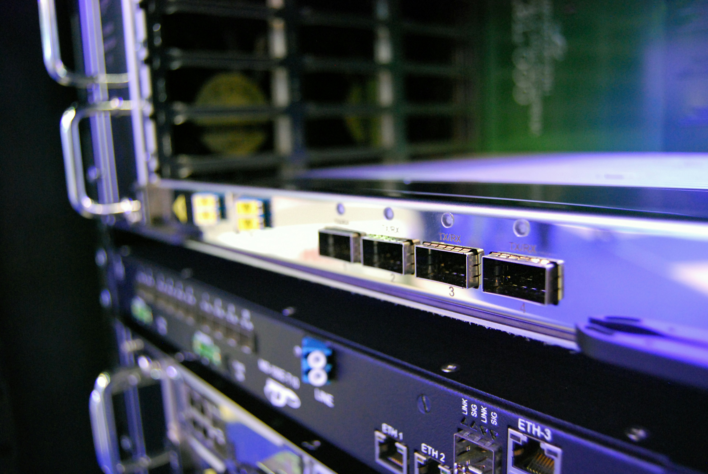
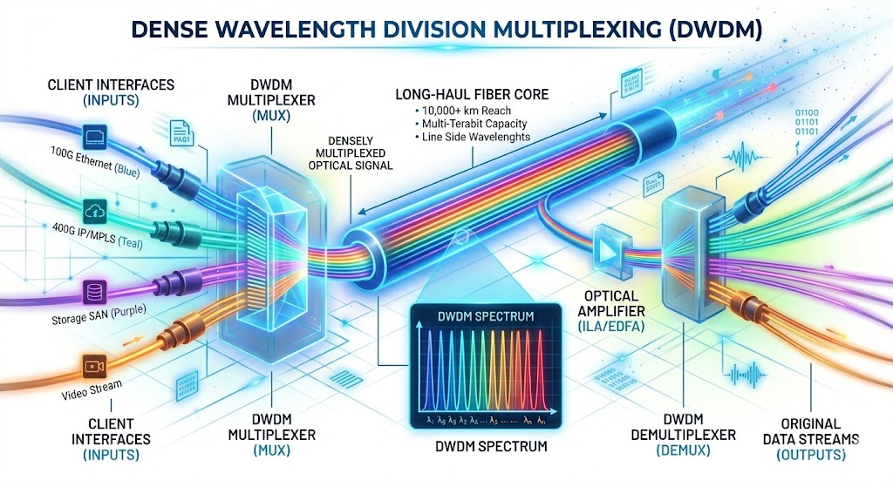

Picture Courtesy: Google Gemini

# From Ethernet Packets to Light: How Data Travels 12,000 km Across Oceans

Have you ever wondered how a voice or video call travels from your home to the farthest corner of the globe? Regardless of the distance, the audio remains crystal clear and the video quality remarkably stable. This is the power of the "network of networks"—the Internet. While the Internet is described as a global highway, the true engineering marvel lies in how the traffic is managed and who is "driving" on that highway. These factors ultimately dictate latency, throughput and the overall user experience.

To put this into perspective, consider a single data packet whether it is a video stream, a message, or a social media post. How does it travel from New York to Chennai—a distance of over 12,000 km—in a mere fraction of a second?

The answer lies in **light**, the fastest phenomenon known to science, whose speed is the universe’s ultimate limit. However, light alone is only half the story. To understand this global feat, we must delve deeper into the sophisticated engineering, architectural design and complex systems that harness the speed of light to make this possible on a global scale.

## **Copper Has Limits, Optical Fiber Changes the Game**

Ethernet over copper has served as the default medium for connecting routers, switches and end devices in LAN environments for several decades. However, copper is subject to well-defined physical limitations. In standard Ethernet (1000BASE-T, 10GBASE-T), the maximum supported distance is approximately 100 meters. This limit is not arbitrary; rather, it is dictated by signal attenuation, noise, crosstalk (NEXT/FEXT) and timing constraints.

From a design perspective, copper is optimized for short-reach, high-speed communication within confined spaces rather than long-haul transport. Conversely, optical fiber exhibits attenuation characteristics that are orders of magnitude superior to copper (typically ~0.2 dB/km in modern single-mode fiber) by operating in the optical domain using light.

**This technical advantage translates to:**

* **Unregenerated reach of 80–100 km**, allowing optical signals to span vast distances without the need for active electronic processing.
* **Extended span capabilities** through the use of optical amplification, such as **EDFA** (Erbium-Doped Fiber Amplifier) or **Raman Amplifiers**.
* **Global reach via multi-span systems**, where amplification chains allow signals to routinely travel thousands of kilometers **(3,000+ km)** while remaining in the optical domain.
* **Transoceanic connectivity** through submarine cable systems, which utilize carefully engineered amplification stages to easily extend beyond **10,000–12,000 km**.

This is the physical foundation of the global internet—optical fiber laid across continents and ocean floors, carrying massive volumes of data as light.

Photo by <a href="https://unsplash.com/@kirill2020?utm_source=unsplash&utm_medium=referral&utm_content=creditCopyText">Kirill Sh</a> on <a href="https://unsplash.com/photos/ZHZRG5CLRlY?utm_source=unsplash&utm_medium=referral&utm_content=creditCopyText">Unsplash</a>

## **Routers Speak Packets, but Transponders Speak Light**

In real-world deployments, high-end routers and switches from vendors like Cisco and Arista operate purely in the packet domain. Typically, the **Cisco ASR 9000 Series** or **Cisco NCS 5500 Series** in a service provider core and the **Arista 7500R Series** or **Arista 7800R Series** in a data center spine/core, fall under this segment. These platforms process and forward Ethernet/IP/MPLS packets at very high throughput (**100G/400G and beyond**); however, they fundamentally operate in the electrical domain (or via client-side optics like Short Range /LR pluggables). They are not designed to drive long-haul optical signals across hundreds or thousands of kilometers.

So, the obvious question is: where does the transition from the packet domain to the long-haul optical domain actually happen?

---

Vendors like Fujitsu, Ciena and others build carrier-grade optical transport platforms specifically for this purpose. Fujitsu 1FINITY T-Series, Ciena Waveserver 5, Ciena 6500 Packet-Optical Platform to name a few. These systems act as **transponders/muxponders**, forming the bridge between packet networks and optical transport networks.

Think of a transponder as a high-performance translator between two domains:

* **Client side → Ethernet/MPLS(Multi Protocol Label Switching) frames from routers/switches via a Grey Optic (QSFP28 or QSFP-DD pluggable)**: This interface serves as the handoff between the packet-switching layer and the transport layer. It typically uses "Grey Optics"—standard, single-wavelength pluggables—to carry high-capacity traffic over short distances within the data center or central office.

* **Line side → Coherent optical wavelengths for Dense Wavelength Division Multiplexing (DWDM) systems**: This is where the transition to long-haul occurs. The "Line side" utilizes DWDM, a core technology that multiplexes multiple data streams onto a single fiber by assigning each to a specific, high-precision wavelength (or "color") of light.

---

This packet-to-optical conversion layer is what enables routers sitting in data centers or Point Of Presence (PoPs) to seamlessly communicate across continents without ever “knowing” the complexity of the optical transport underneath. Ethernet traffic from a router enters the transponder where the short reach grey signal is terminated and the raw Ethernet frames are mapped into an OTN (Optical Transport Network) wrapper (like an OTU4).

## **The Core Idea: DWDM**

Instead of sending just one signal per fiber, DWDM allows multiple signals to coexist. Each signal is carried on a different wavelength (color of light). In a single fiber, sometimes 80+ wavelengths are sent and each wavelength can carry 100G, 400G or 800G (modern systems) which means a single fiber can carry multiple terabits per second.

That’s the real backbone of the internet.

A typical DWDM system include these core components for its working:

* **Optical transceivers:** converts electrical signals to grey optics.
* **Transponders:** to map one client service onto specific wavelength (or color).
* **Muxponders (mux or demux):** to combine multiple client service onto single high-capacity wavelength.
* **Optical amplifiers:** to extend transmission reach over hundreds or thousands of kilometers.
* **ROADMs (Reconfigurable Optical Add-Drop Multiplexers)**: to dynamically route and manage wavelengths (or colors) in the network.

A significant trend in modern architecture is IP over DWDM (IPoDWDM). By using coherent pluggable optics (like 400G ZR+) directly in the router, we can bypass the standalone Transponder stage entirely. This collapses the layers, allowing the router to transmit 'colored' wavelengths directly into the optical line system.

## **Long Distance: Amplification Matters**

Even with fiber, signals don’t stay perfect forever. Since they weaken over distance, optical amplifiers (like EDFA) or Raman amplifiers are used. These are placed at intervals (~80-100km) across the fiber especially in submarine cables. It is fascinating that these amplifiers are powered using submarine cables which are wrapped in a copper sheath (along with the fiber optic cable) carrying high-voltage electricity from the shore stations on both sides. This amplification technique is what allows signals to travel thousands of kilometers without being converted back to electrical form. Fujitsu 1FINITY L-Series blades are ideally suited for this purpose.

The entire journey so far is simplified:

That’s our packet’s journey across continents.

## **How Much Data Are We Talking?**

This is where the scale of modern optical systems really stands out. A single coherent wavelength today can carry up to 800G, with next-generation systems already pushing toward 1.2T–1.6T using advanced modulation (16-QAM or 64-QAM) and Digital Signal Processing(DSP) techniques. When multiple wavelengths are multiplexed over a single fiber using DWDM, total capacity scales to 10–20 Tbps and beyond and with tighter channel spacing and improved spectral efficiency, it can go even higher. This level of capacity is what underpins hyperscale cloud infrastructure from companies like Amazon, Google and Microsoft, while also sustaining ever-growing video streaming demand, global internet traffic and data-intensive AI workloads.

## **Future: With AI and large-scale compute**

Data center traffic is exploding with massive east-west flows and an insatiable demand for bandwidth. As a result, we are seeing a shift toward tighter integration between Ethernet and optics. Next-generation network innovators like **Arrcus**, collaborating with optical leaders like **Fujitsu and their 1FINITY platform**, are prime examples of this evolution. It wouldn’t be surprising if more of the data center fabric itself becomes entirely optical over time.

This transition to light is even moving beyond our planet. **NASA’s Lunar Laser Communications Demonstration (LLCD)** has already made history by using pulsed laser beams to transmit data over the **239,000 miles** between the Moon and Earth at a record-breaking download rate of **622 Mbps**. This proves that whether in a sub-sea fiber or across the vacuum of space, light is the ultimate vehicle for information.

Today, every packet you send is converted into light, traveling across oceans, sharing fiber with dozens of other signals and reaching its destination in milliseconds. All of this happens silently, reliably and at a massive scale.

That is the Internet we use every day and the true power of networking. **Lights everywhere**.

## **References:**

1. https://en.acnnewswire.com/press-release/english/87318/kddi,-cisco,-and-fujitsu-start-full-scale-operation-of-telecommunications-network-to-reduce-power-consumption-by-approximately-40
2. https://arrcus.com/news/fujitsu-1finity-and-arrcus-sign-strategic-partnership-agreement-to-deliver-innovative-network-solutions-for-ai-infrastructure
3. https://www.vcelink.com/blogs/focus/what-is-dwdm?srsltid=AfmBOopmc5Xx6RGcboeN1mV76dli4iOfQ7a5TK7R_1MkH3s6QNEBn-gK
4. https://www.qsfptek.com/qt-news/transponder-fiber-optical-repeater-for-dwdm-system.html?srsltid=AfmBOoqOCC5K0XbvWM3fFQZt-8DHxFnzO6OO41cHAuz4iUK1ixqUApNA
5. https://www.nasa.gov/missions/tech-demonstration/laser-communications-relay/nasa-laser-communications-system-sets-record-with-data-transmissions-to-and-from-moon/

**About Author:**

Karthikeyan is currently working in Vantiva Broadband as Principal Software Engineer. He worked on Fujistu 1FINITY products like Flashwave 9500, Transponder series (T-series), Lambda (optical line) systems contributing in DCN side and was part of Cisco's Connected Device Business Unit. He worked on CDMA 1xEVDO protocols teams during initial deployments of FemtoCells in Airvana Networks(now Commscope).
