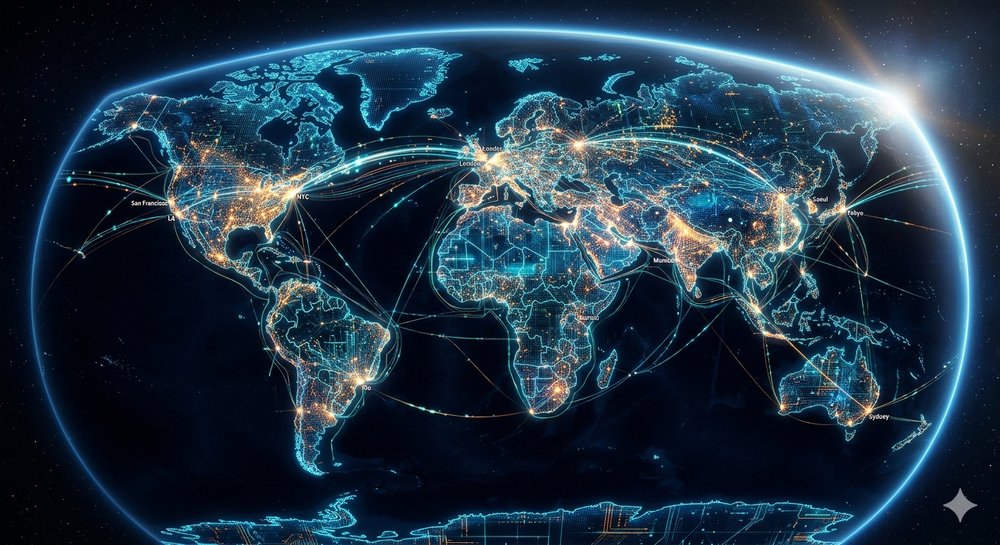
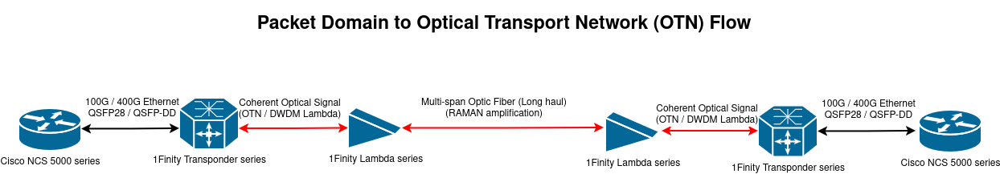

## From Ethernet Packets to Light: How Data Travels 12,000 km Across Oceans

Ever wondered how you’re able to make a voice or video call from your home to the farthest corner of the world? Most of the time, the voice is crystal clear and the video quality is surprisingly good. That’s the power of the internetwork of networks—the Internet. We often say the Internet is the highway. But what really matters is who is driving on that highway and how efficiently the traffic is handled. That’s what decides latency, throughput and overall experience.

Now, this is where it hits differently for a person who has this question. How does a packet—whether it’s a video call, a WhatsApp message or a LinkedIn post—travel from New York to Chennai (over 12,000 km away) in just a second or two?

Your guess is right. Light—the fastest phenomenon known to science, whose speed is the universe’s ultimate speed limit.  However, simply saying “light” is not sufficient; let us delve deeper into the engineering, design and systems that make this possible on a global scale.

**Copper Has Limits, Optical Fiber Changes the Game**

For any network engineer, Ethernet over copper is almost second nature. It is the default medium for connecting routers, switches and end devices in LAN environments. But copper has very well-defined physical limits. In standard Ethernet (1000BASE-T, 10GBASE-T), the maximum supported distance is ~100 meters which is not arbitrary but rather dictated by signal attenuation, noise, crosstalk (NEXT/FEXT) and timing constraints. As distance increases, the signal degrades, leading to higher bit error rates, frame corruption and eventually link failure. From a design perspective, copper is optimized for short-reach, high-speed communication within a confined space but not for long-haul transport.

This is where optical fiber fundamentally changes the game. Instead of electrical signaling, fiber operates in the optical domain using light propagated through glass. The attenuation characteristics are orders of magnitude better than copper (typically ~0.2 dB/km in modern single-mode fiber).

Because of this:

* Signals can travel 80–100 km without regeneration in standard long-haul systems.
* With optical amplification (like EDFA), spans can be extended significantly.
* In multi-span systems with amplification chains, signals routinely travel thousands of kilometers (3000+ km)
* Submarine cable systems, with carefully engineered amplification stages, easily extend beyond 10,000–12,000 km.

This is the physical foundation of the global internet—optical fiber laid across continents and ocean floors, carrying massive volumes of data as light.

**Routers Speak Packet, but Transponders talk Light**

In real-world deployments, high-end routers and switches from vendors like Cisco and Arista operate purely in the packet domain. Typically, Cisco ASR 9000 Series or Cisco NCS 5500 Series in a service provider core and Arista 7500R Series or Arista 7800R Series in data center spine/core fall under this segment.
These platforms process and forward **Ethernet/IP/MPLS packets** at very high throughput (100G/400G and beyond), but fundamentally, they operate in the **electrical domain (or short-reach optics like SR/LR pluggables)**.

They are not designed to drive long-haul optical signals across hundreds or thousands of kilometers.

So the obvious question is:

**Where does the transition from packet domain to long-haul optical domain actually happen?**

---

This is where dedicated optical transport platforms come into the picture. Vendors like Fujitsu, Ciena and others build carrier-grade systems specifically for this purpose.

Typical examples include:

* Fujitsu 1FINITY T-Series
* Ciena Waveserver 5
* Ciena 6500 Packet-Optical Platform

These systems act as **transponders/muxponders**, forming the bridge between packet networks and optical transport networks.

---

You can think of a transponder as a high-performance translator between two domains:

* Client side → Ethernet/IP/MPLS (from routers/switches) via a Grey Optic (QSFP28 or QSFP-DD pluggable)
* Line side → Coherent optical wavelengths (for DWDM systems)

---

This packet-to-optical conversion layer is what enables routers sitting in data centers or POPs to seamlessly communicate across continents without ever “knowing” the complexity of the optical transport underneath. Ethernet traffic from a router enters the transponder where the short reach grey signal is terminated and the raw Ethernet frames are mapped into an OTN (Optical Transport Network) wrapper (like an OTU4 or ASU) and heavy duty Forward Error Correction are injected. The data is modulateed onto a specific DWDM Wavelength to be sent to the Mux and OLS. At the far end, the reverse happens.

**The Core Idea: DWDM**

The real power of optical networks comes from Dense Wavelength Division Multiplexing (DWDM). Instead of sending just one signal per fiber, DWDM allows multiple signals to coexist. Each signal is carried on a different wavelength (color of light). In a single fiber, sometimes 80+ wavelengths are sent and each wavelength can carry 100G, 400G or 800G (modern systems) which means a single fiber can carry multiple terabits per second.

That’s the real backbone of the internet.

**Long Distance: Amplification Matters**

Even with fiber, signals don’t stay perfect forever. Since they weaken over distance, we use optical amplifiers (like EDFA) or Raman amplification (used in long-haul systems to boost signal quality). These are placed at intervals across the fiber—especially in submarine cables. This is what allows signals to travel thousands of kilometers without being converted back to electrical form. This is where Fujitsu 1FINITY L-Series blades come into picture.

**End-to-End Flow (Putting It Together)**

The entire journey so far is simplified:

That’s our packet’s journey across continents.

**How Much Data Are We Talking?**

This is where the scale of modern optical systems really stands out. A single coherent wavelength today can carry up to 800G, with next-generation systems already pushing toward 1.2T–1.6T using advanced modulation and DSP techniques. When multiple wavelengths are multiplexed over a single fiber using DWDM, total capacity scales to 10–20 Tbps and beyond, and with tighter channel spacing and improved spectral efficiency, it can go even higher. This level of capacity is what underpins hyperscale cloud infrastructure from companies like Amazon, Google, and Microsoft, while also sustaining ever-growing video streaming demand, global internet traffic, and data-intensive AI workloads.

**Future: With AI and large-scale compute**

Data center traffic is exploding. East-west traffic is massive. Bandwidth demand keeps increasing. There’s already movement toward tighter integration between Ethernet and optics. Companies like Arrcus working with optical platforms like Fujitsu’s 1FINITY is one such example.
Honestly, it wouldn’t be surprising if more of the data center fabric itself becomes optical over time.

Today, every packet you send, gets converted into light travelling across oceans, sharing fiber with dozens of other signals and finally reaching the destination in milliseconds. And all of this happens silently, reliably, at massive scale.

That’s the internet we use every day and the power of networking. Lights everywhere.

**References:**
https://en.acnnewswire.com/press-release/english/87318/kddi,-cisco,-and-fujitsu-start-full-scale-operation-of-telecommunications-network-to-reduce-power-consumption-by-approximately-40

**About Author:**

Karthikeyan worked on Fujistu 1finity products like Flashwave 9500, Transponder series (T-series), Lambda (optical line) systems and DCN environments
Seeing Ethernet traffic being converted into light and pushed across long distances—it’s something people don’t fully appreciate until they see it live.
